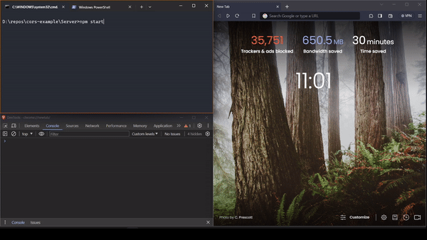

# Handle CORS error on client side

This repo contains an example on CORS error and its resolution using proxy.

[Proxies](https://iproyal.com/blog/what-is-a-proxy-server-and-how-does-it-work/) act as middlemen and forward your requests to the server. The server sees the IP address of the proxy as the origin of the request, and your real IP address is known only to the proxy. Proxies enable you to scrape large amounts of data and make many more requests than you could with a single IP address. The best of them provide a pool of IP addresses through a single, authorized endpoint that enables you to rotate IPs on request.

## Setup

1. Clone the repo
2. Open "Server" and "ClientApp" paths in terminal or command prompt
3. Start the server using `npm start`
4. Run the client app using `npm run dev`, open the app in browser and check the console logs.

## Client App

- In CorsHandled component proxy is being used which will not cause the CORS error
- In CorsError component direct server url is used which will result in "blocked CORS policy" error

## Resources

- [CORS](https://developer.mozilla.org/en-US/docs/Web/HTTP/CORS)
- [Proxy for app created using Vite](https://vitejs.dev/config/server-options.html)
- [Proxy for app created using create-react-app](https://create-react-app.dev/docs/proxying-api-requests-in-development/)
